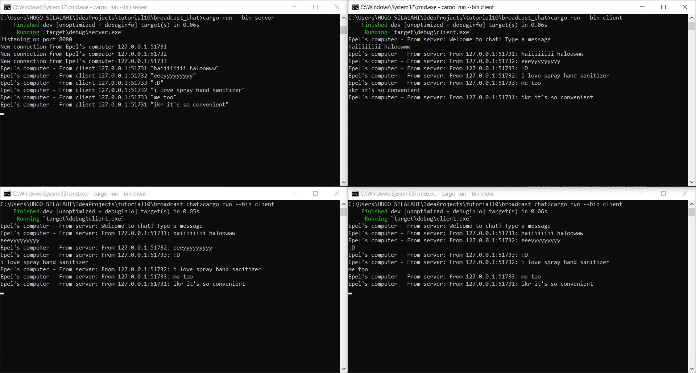

# Tutorial 10

### 2.1. Original code of broadcast chat.

Program ini dijalankan dengan satu terminal untuk server dan tiga terminal untuk client. Server dijalankan dengan `cargo run --bin server` dan client dijalankan dengan `cargo run --bin client`. Setiap kali ada client yang baru disambungkan, server akan mencetak "New connection from {ip address client}" dan mengirimkan pesan "Welcome to chat! Type a message" pada client tersebut.

Pada client, kita bisa mengirim pesan dan mengirim pesan tersebut dengan menekan tombol enter. Setiap kali client mengirimkan message melalui console, server akan mencetak "From client {ip address client} "{pesan dari client}" ", kemudian mengirimkan message tersebut ke semua client dengan format "From server: {message}".

### 2.2. Modifying the websocket port

Pada program server, modifikasi dibuat pada bagian `let listener = TcpListener::bind("127.0.0.1:8080").await?;` agar listener menggunakan port 8080. Selain itu, bagian `println!("listening on port 8080");` juga dimodifikasi untuk mencetak informasi bahwa program sedang menggunakan port 8080.

Pada client, modifikasi dibuat pada bagian `ClientBuilder::from_uri(Uri::from_static("ws://127.0.0.1:8080"))` agar client tersambung pada port 8080. Setelah modifikasi dibuat pada client dan server, program dapat tetap dijalankan dengan baik karena server dan client masih tersambung melalui port yang sama. Client dan server juga menggunakan protokol websocket yang sama yang dihandle oleh `tokio_websockets` dengan `ws_stream`.

### 2.3. Small changes. Add some information to client

Pada server, modifikasi dibuat pada bagian `bcast_tx.send((format!("From {addr:?}: {text}")).into())?;`. Modifikasi tersebut dibuat agar message dari client yang dikirimkan kembali oleh server kepada client akan memuat `addr` (IP dan port) dari client yang mengirim message tersebut. Selain itu, dibuat juga modifikasi pada bagian  `println!("New connection from Epel's computer {addr:?}")` dan `println!("Epel's computer - From client {addr:?} {text:?}")` pada server serta `println!("Epel's computer - From server: {}", text)` pada client sehingga informasi yang di-print kini memuat "Epel's computer".

Hasil dari modifikasi tersebut pada konsol adalah sebagai berikut.

